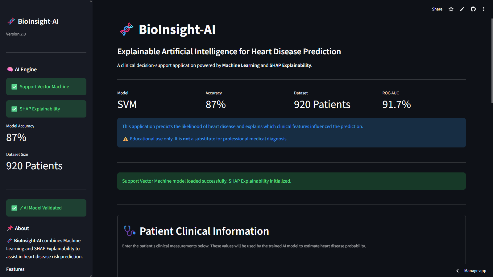
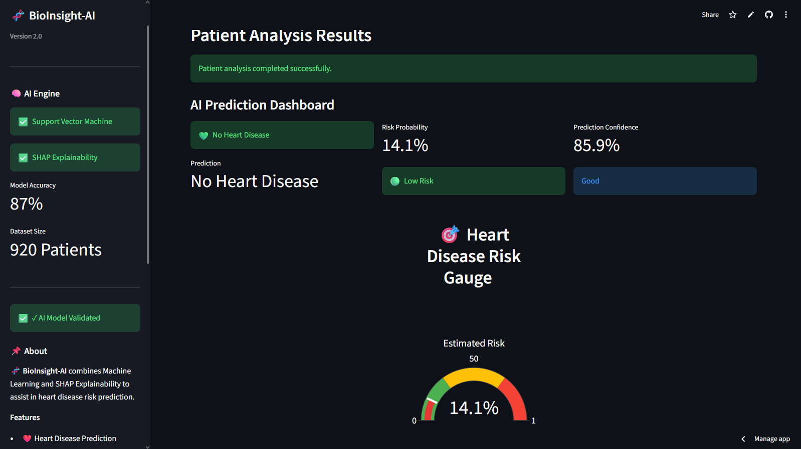
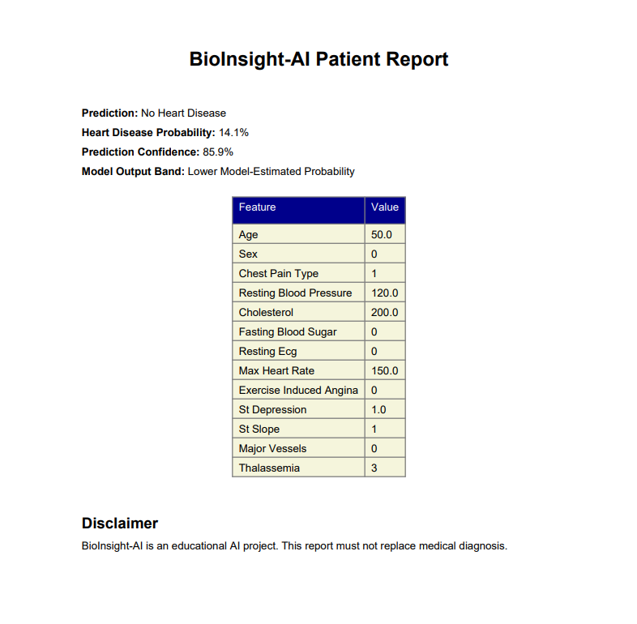

# 🧬 BioInsight-AI
---


---

### Explainable Artificial Intelligence for Heart Disease Prediction

An AI-powered clinical decision support system that predicts the likelihood of heart disease using Machine Learning and explains every prediction with SHAP Explainable AI.

---

## 🌐 Live Demo

👉 **Try BioInsight-AI:** https://bioinsight-ai.streamlit.app

---

## 📌 Overview

BioInsight-AI is an Explainable Artificial Intelligence (XAI) web application designed to predict the likelihood of heart disease using machine learning while providing transparent explanations for every prediction through SHAP (SHapley Additive Explanations).

The system combines predictive analytics, interactive visualizations, and automated PDF reporting to support transparent and interpretable clinical decision-making.

---

## 🎯 Why BioInsight-AI?

Traditional machine learning models often function as **black boxes**, providing predictions without explaining how decisions are made. This lack of transparency can reduce trust, especially in healthcare applications where understanding the reasoning behind a prediction is important.

BioInsight-AI addresses this challenge by combining a high-performing **Support Vector Machine (SVM)** model with **SHAP Explainable AI**, allowing users to visualize how individual clinical features influence each prediction. This improves transparency, interpretability, and confidence in the system's results.

---
---

# 📸 Application Screenshots

## 🏠 Home Dashboard

The landing page provides an overview of the application, including the machine learning model, performance metrics, dataset information, and system status.



---

## ❤️ Heart Disease Prediction

Users can enter patient clinical parameters to predict the likelihood of heart disease. The application also provides a prediction confidence score and a detailed patient summary.



---

## 📄 Automated PDF Report

After each prediction, BioInsight-AI generates a professional PDF report containing patient information, prediction results, probability scores, and clinical recommendations.



---

## ✨ Features

- ❤️ Heart Disease Risk Prediction
- 🧠 Support Vector Machine (SVM) Model
- 📊 SHAP Explainable AI
- 📈 Interactive Data Visualizations
- 📄 Automated PDF Report Generation
- 🌐 Streamlit Web Application
- 📋 Patient Clinical Summary
- ⚡ Fast Real-Time Prediction

---

## 💻 Tech Stack

| Category | Technology |
|----------|------------|
| Language | Python |
| Machine Learning | Scikit-Learn |
| Model | Support Vector Machine (SVM) |
| Explainability | SHAP |
| Visualization | Plotly, Matplotlib |
| Web Framework | Streamlit |
| Report Generation | ReportLab |
| Version Control | Git & GitHub |

---

## 📊 Model Performance

| Metric | Value |
|---------|-------|
| Model | Support Vector Machine (SVM) |
| Accuracy | 87% |
| ROC-AUC | 91.7% |
| Dataset | 920 Patients |
| Explainability | SHAP AI |

---

## 🚀 Installation

```bash
git clone https://github.com/ajaykumar023/BioInsight-AI.git

cd BioInsight-AI

pip install -r requirements.txt

streamlit run app/app.py
```

---

## 📂 Project Structure

BioInsight-AI/

├── app/

├── data/

├── models/

├── notebooks/

├── reports/

├── src/

├── tests/

├── requirements.txt

└── README.md

---

## 🎯 Future Scope

- Multi-Disease Prediction
- Integration with Electronic Health Records (EHR)
- Deep Learning Models
- Cloud-Based Deployment
- Doctor Dashboard
- Mobile Application

---

## 🤝 Contributors

### 👨‍💻 M Ajay Kumar
- Project Creator
- ML model development
- Streamlit application
- Data preprocessing
- SHAP explainability
- UI/UX design
- Deployment & documentation

GitHub: https://github.com/ajaykumar023

---

### 👨‍💻 Amogh Amarapur
- Contributed to selected development tasks
- Assisted with testing and debugging
- Provided feedback during development
- Contributed to project documentation and paperwork

GitHub: https://github.com/Whoviancoder136

---

## 🤝 Acknowledgements

Special thanks to **Amogh Amarapur** for assisting with testing, debugging, and providing valuable feedback during the development of this project.

---

## 👥 Team

| Name | Role |
|------|------|
| **M Ajay Kumar** | Project Lead, AI/ML Development, Streamlit App, Documentation |
| **Amogh Amarapur** | Development Support, Testing & Feedback |

---

---

## 📜 License

This project is licensed under the **MIT License**.

You are free to use, modify, and distribute this project under the terms of the MIT License.

For more details, see the [LICENSE](LICENSE) file.

---